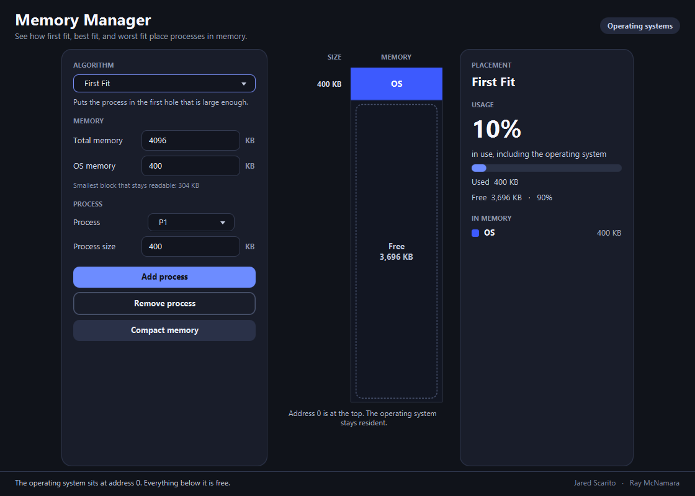
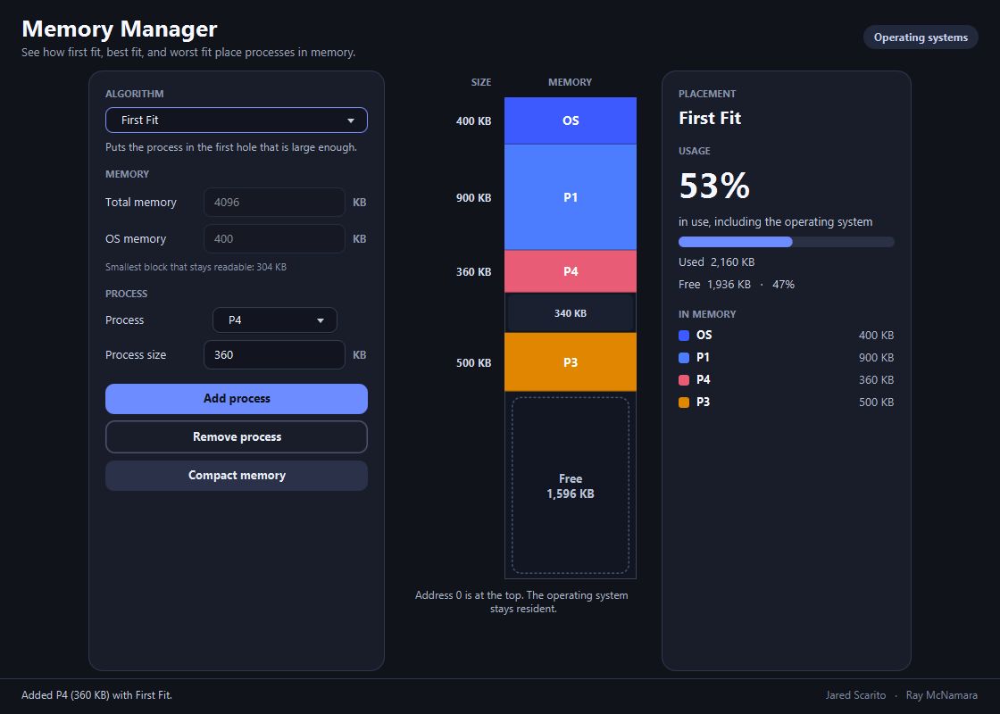
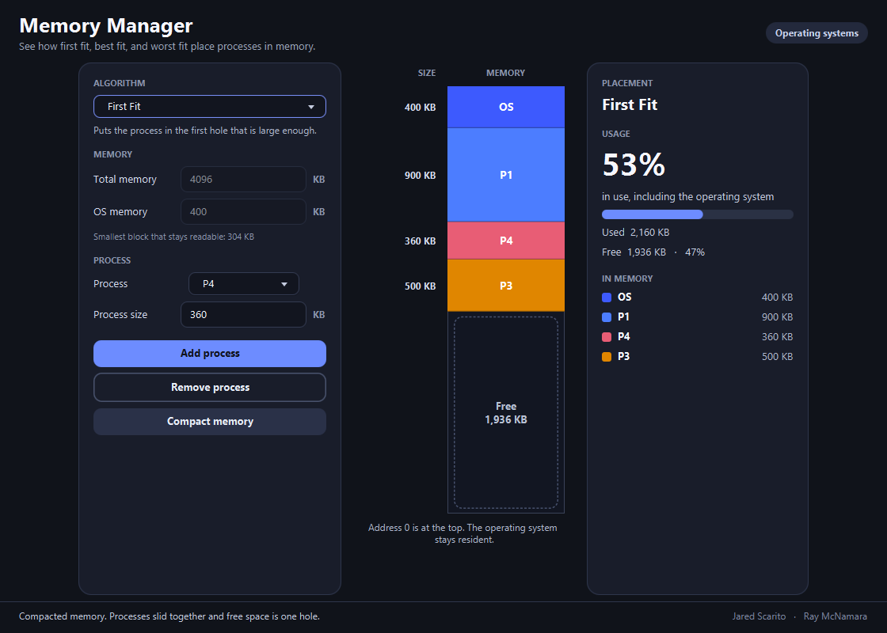

# Memory Manager

[](LICENSE)


Memory Manager shows how an operating system places jobs in contiguous memory. Choose a fit algorithm, add and remove processes, and watch the free holes change. Compaction slides the jobs back together so the free space is one hole again.

It was written for Sister Jane's COM 310 Operating Systems assignment.

## Watch a run

First Fit loads three processes, removes one, drops a smaller process into the hole that removal left, then compacts.


## How to read the map

Address 0 is at the top. The operating system stays there. Each color is a process, and a dashed region is free memory.



In the run above, First Fit put P4 into the hole P2 left behind. P4 needed 360 KB of that 700 KB hole, so 340 KB stayed free between P4 and P3. Another 1,596 KB was still free at the bottom.



## Fit algorithms

The algorithm you pick is used the next time you add a process. Processes already in memory stay where they are.

- **First fit** walks memory from address 0 and uses the first hole that is large enough.
- **Best fit** uses the smallest hole that can hold the process.
- **Worst fit** uses the largest hole, which leaves a bigger leftover.

## Compaction

Compact slides the blocks toward address 0 without changing their order. After the picture above, free memory is a single 1,936 KB hole.



## Run it

Install JDK 21. The Maven Wrapper downloads Maven on the first run.

Windows:

```bat
mvnw.cmd javafx:run
```

macOS and Linux:

```bash
./mvnw javafx:run
```

From IntelliJ, import the Maven project and run `com.jaredscarito.memory_manager.main.Main` on JDK 21.

## Rules the simulator follows

- Process ids are P1 through P9, and each id can be in memory only once.
- The operating system is always resident at address 0.
- A block has to be at least 40 pixels tall so its label stays readable. The window shows that minimum in KB for the current total memory.
- Total memory and OS memory can be edited until the first process is added. They unlock again when only the operating system remains.
- A process that cannot fit in any hole is not added.

## Credits

Jared Scarito and Ray McNamara.

Licensed under the [MIT License](LICENSE).
